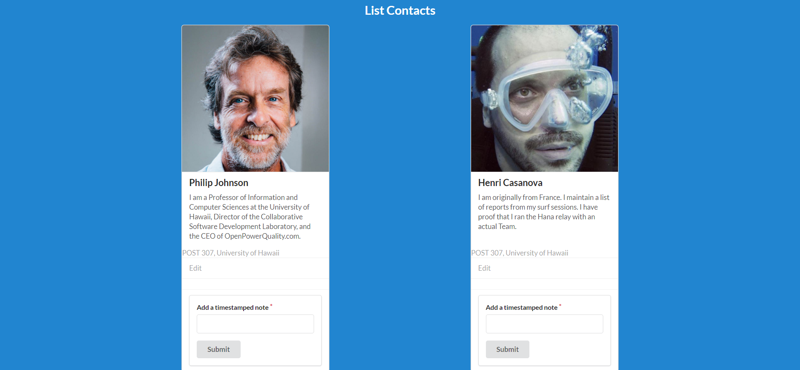

#Installation

Install meteor

Download a copy of Digits

cd into /app directory

Install libraries with: meteor npm install

Run the app with: meteor npm run start

If everything works and you get to this message

you can open the app in http://localhost:3000

#User interface Walkthrough

##Landing

At this page, you can sign in or sign up for an account if you don't have one.

##Sign Up

At this page, you can create an accounnt by inputting your e-mail and personal password.

##Log In

If you already have an account, you can sign in on this page with your e-mail and password.

##Profile

At this page, you have two options:

  Add Contact - adds a new contact
  
  List Contacts - Lists existing contacts
  
##Add Contact

Here you can add a new contact by filling in the required information

##List Contacts

Here your current contacts are listed. Each contact has an "Edit" option and a text field to "add note". "Edit" allows you to change existing contact information. "Add Note" allows timestamped notes that can be added for each contact.

##Edit Contact

Here you can edit an existing content by replacing or adding text in the required fields. Submit will save all your changes.
